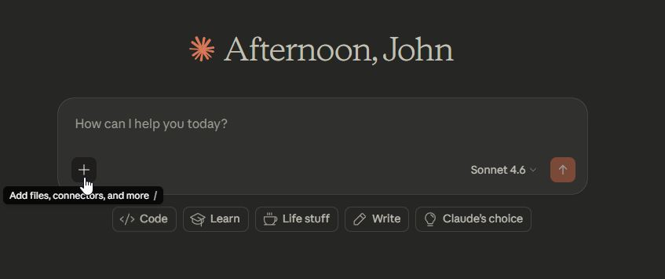
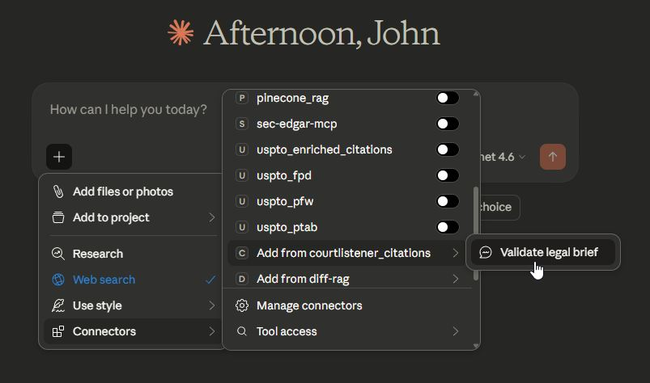
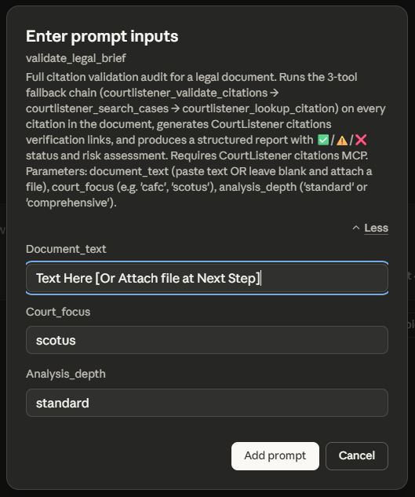
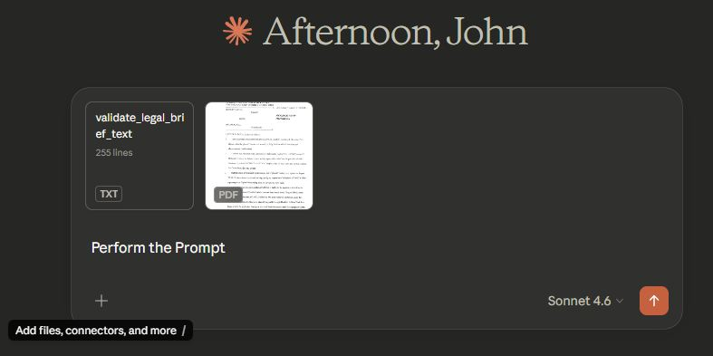

# CourtListener Citation Validation MCP — Prompt Templates

This document details the prompt template included with the CourtListener Citation Validation MCP Server.

## ⚡️ Prompt Templates

**The CourtListener Citation Validation MCP includes 1 prompt template** that appears in the Claude Desktop UI. This template automates the complete multi-step citation audit workflow — no need to remember tool names or call sequences.

### 🎯 **How to Use Prompt Templates**

1. **In Claude Desktop**: Press the `+` button

   > 

2. **Select "Add from courtlistener_citations"** from the dropdown menu and select `validate_legal_brief`

   > 

4. **Fill in the parameters** — paste your document text (or Leave Blank and attach the document at next step), optionally set court focus and analysis depth.  Hit the "Add prompt" button.

   > 

5. **Click Execute** — For best results type "Perform Prompt" and start the chat.  (If you left Blank the "Document_text" field in step #3 then be sure to attach you document at this step, like in the example) Claude will run the complete workflow

   > 

---

## Overview

The prompt template is an AI-optimized execution plan designed for legal professionals validating AI-generated documents. It provides a structured, automated workflow covering citation discovery, API validation, fallback searches, mismatch detection, and risk assessment — all in a single prompt invocation.

---

## 📋 Citation Validation Template

### `/validate_legal_brief` — Full Citation Hallucination Audit

**Purpose**: Complete citation audit of a legal document — detects fabricated citations, mismatched cases, and ambiguous reporters in one automated workflow.

**Key Features**:
- **Step 0 — Local inventory**: Runs `courtlistener_extract_citations` (eyecite) first — free, no API, instant. Counts and classifies all citation types before any API call.
- **Step 1 — Primary validation**: `courtlistener_validate_citations` checks all case citations against CourtListener's 9M+ opinion database in a single API call
- **Step 2 — Fallback chain**: For any 404, automatically runs up to 4 `courtlistener_search_cases` strategies (full name → simplified → first party → no court filter)
- **Step 3 — Last resort**: `courtlistener_lookup_citation` for any citation that survives all fallback attempts
- **Mismatch detection** (comprehensive mode): Compares the resolved case name against what the document claims — flags citations where the reporter number is real but points to a completely different case
- **Structured report**: ✅/⚠️/❌ status for every citation with CourtListener links
- **Risk assessment**: CRITICAL / HIGH / MEDIUM / LOW classification with recommended actions

**Parameters**:

| Parameter | Required | Default | Description |
|-----------|----------|---------|-------------|
| `document_text` | No | (blank) | Paste the full text of the brief, motion, or memo — **or leave blank and attach the document file** (PDF, Word, txt). Claude will read the attachment automatically. |
| `court_focus` | No | (inferred) | Primary court identifier — e.g., `scotus`, `cafc`, `ca9`. Speeds up fallback searches when known. |
| `analysis_depth` | No | `comprehensive` | `standard` (validate + link only) or `comprehensive` (also check mismatches, party name confusions, zero-citation signals) |

> **Tip:** To use a file attachment instead of pasting text — leave `document_text` blank, attach your PDF or Word document to the conversation before clicking Execute, and Claude will read the file and run the full audit on it.

**Use Cases**:
- Pre-filing citation audit for AI-drafted briefs
- Hallucination detection in motions, memos, and research memos
- Quality control before attorney review
- Identifying mismatched party names — citations that resolve to a completely different case than claimed
- Federal Circuit patent briefs (set `court_focus: cafc`)
- Supreme Court briefs (set `court_focus: scotus` — handles U.S. vs S. Ct. reporter discrepancies automatically)

**Sample Output**:
```
📊 VALIDATION SUMMARY
━━━━━━━━━━━━━━━━━━━━━━━━━━━━━━
All Citations Identified:   17
  Case citations:           11  (validated against CourtListener)
  Statutory citations:       5  (not validatable)
  Id. / supra references:    1  (resolved)

Case Citation Results:
✅ Verified:                 8
⚠️  Partial Matches:         1
⚠️  Mismatches:              1
❌ Not Found:                1

🚨 RISK ASSESSMENT
Overall Risk Level: HIGH
1 citation not found — likely AI fabrication. Review immediately.
1 citation resolves to a different case than claimed. Correct before filing.
```

**Integration**:

| Tool Used | Step | Purpose |
|-----------|------|---------|
| `courtlistener_extract_citations` | Step 0 | Local citation inventory (eyecite — no API) |
| `courtlistener_validate_citations` | Step 1 | Primary API validation |
| `courtlistener_search_cases` | Step 2 | Fallback for 404s (4 strategies) |
| `courtlistener_lookup_citation` | Step 3 | Last resort direct lookup |
| `courtlistener_get_cluster` | Steps 2–3 | CourtListener URL + case details for all found citations |

---

## 🔧 Manual Prompt Workflows

For cases where the full audit is not needed, these prompts can be typed directly into Claude:

### Quick Citation Spot-Check
```
Validate these citations and provide CourtListener links for any that are found:

[PASTE CITATIONS HERE]
```

### Hallucination Triage
```
I suspect these citations may be AI hallucinations. Investigate each one using
courtlistener_validate_citations, then courtlistener_search_cases if 404, and
flag any where the citation resolves to a different case than claimed.

[PASTE SUSPECT CITATIONS HERE]
```

### Citation Inventory Only (no API)
```
Use courtlistener_extract_citations to get a full citation inventory for this
document. Report counts by type.

[PASTE DOCUMENT HERE]
```

### Pre-Filing Checklist
```
Pre-filing citation audit. Run validate_legal_brief (comprehensive), generate
CourtListener links for every verified case, flag any citation_count=0 on cases
older than 12 months, and produce a filing checklist at the end.

[PASTE BRIEF HERE]
```

---

## 📊 Guidance Sections

The `courtlistener_citations_get_guidance` tool provides on-demand workflow help (no API call, instant):

| Section | Content |
|---------|---------|
| `overview` | What this MCP does, when to use it, tool reference |
| `workflow` | Full discovery + 3-tool fallback chain explained |
| `response_format` | How to format results with ✅/⚠️/❌ symbols |
| `hallucination_patterns` | Common AI hallucination detection patterns |
| `edge_cases` | SCOTUS parallel citations, state courts, unpublished opinions |
| `risk_assessment` | How to interpret risk levels |
| `limitations` | CourtListener coverage gaps and false negatives |

```
Use courtlistener_citations_get_guidance with section="overview"
Use courtlistener_citations_get_guidance with section="workflow"
Use courtlistener_citations_get_guidance with section="risk_assessment"
Use courtlistener_citations_get_guidance with section="limitations"
```

---

## Common Court Identifiers

| Identifier | Court |
|------------|-------|
| `scotus` | U.S. Supreme Court |
| `cafc` | Federal Circuit |
| `ca1` – `ca11` | First through Eleventh Circuits |
| `cadc` | D.C. Circuit |
| `dcd` | District of D.C. |

---

*For detailed usage examples and integration workflows, see [USAGE_EXAMPLES.md](USAGE_EXAMPLES.md).*

*For setup and installation guidance, see [README.md](README.md) and [INSTALL.md](INSTALL.md).*
